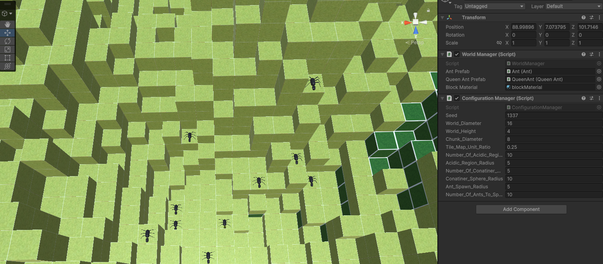

# Assignment 3: Antymology
As a preface, this is unfortunately not entirely finished. I have implemented the required ant behaviour but the UI and any experimentation with the evolutionary algorithm has not been completed. This looked like a really cool project and I wish I could have spent some time getting a neural network set up for the ants, I might come back to this after I finished the semester to tinker some more.

## Ant Behaviours
All of the specified behaviours have been implemented. This can be tested by clicking play and selecting an ant from the Scene Hierarchy to enable the variable "User Controls Enabled". This will allow the ant selected to be moved by the user. 

### User Controls
For user controls to be active the variable "User Controls Enabled" on any ant in the hierarchy must be set to true.

Arrow keys left, up, right - move the ant in a direction

Arrow key down - Either dig or consume mulch below the ant

Space Bar - Transfer health to other ants on the same block

### Spawn
All ants spawn around the center of the map. The queen is placed directly in the middle and ants are spawned in a radius surrounding the queen. The radius size and number of ants are specified on variables of the WorldManager > Configuration Manager Script
- Ant_Spawn_Radius
- Number_Of_Ants_To_Spawn

### Ant Actions
Ants can perform 6 actions by calling the corresponding method inside the Ant script.
#### Move Forward
Ants can only move if it is a 0 or 1 block step.
#### Turn Right
Rotates the ant to the right 90 degrees.
#### Turn Left
Rotates the ant to the left 90 degrees.
#### Comsume Mulch Block Below
Will delete the block below and move the ant down. Cannot be done if other ant is on the same block.
#### Dig
Will delete the block below and move the ant down.
#### Transfer Health To Overlapping Ants
For each overlapping ant, will remove healthTranferRate and send it to the overlapping ant.

### Queen Ant Actions
The queen is given a crown to allow the her to be identified.
Can do the same actions as worker ants while also being able to,
#### Create Nest Block
Places a nest where the queen is, and moves the queen up one block to be on top of the nest.

### Senses
Ants have a way to percieve the world, this can be done in the senses region of the Ant script. Everything there is simply scanning the world in a certain direction to determine what block is there.

### Simulation
The simulation is executed independently on each ant. The tickSimulation() function is invoked repeatedly (setup in the Awake() function of the ants). This handles the constant health damage decay, increasing the decay if the ant is on acid, and ensuring the ants do not float if another ant digs below it.

This is also where the ants decisions on what actions to take would be made from its neural network "brain" if I had got around to implementing it.

## Evolutionary Aspects
There are currently no evolutionary aspects implemented. The plan was to give all ants a brain using a neural network, where the input layer would be (some of) the ants senses, and the output layer would be all the actions. All the worker ants would share the same weighting and the queen ant would have her own neural network because she can also place nest blocks.

We would execute some amount of ant colonies in each generation and measure their fitness by how long they survived. Performing genetic operators on the NN weights like crossover and mutation after selecting some of the highest fitness value colonies.

Again, I really wish I could have implemented this as it is one of the most interested assignments I have seen at U of C so far. Hopefully the work I have done has earned me some marks.